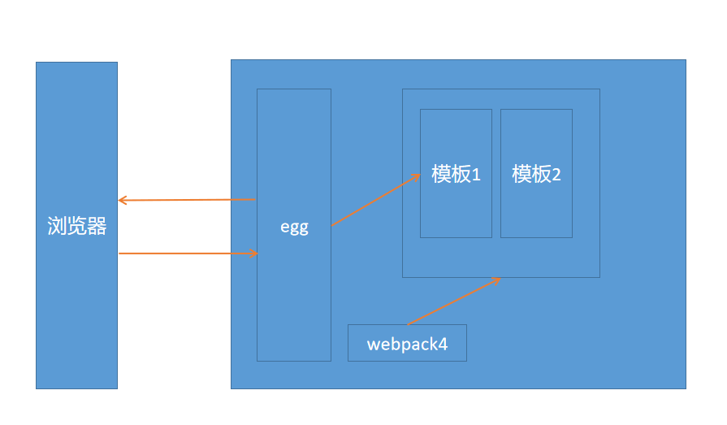

# 框架浅析
主要讲解开发中需要用到的知识

## 框架原理
   
在我们开发过程中，webpack4相当于一个模板生成者，egg是模板的使用者。原理就是这么简单，但是需要webpack4和egg无缝的配合起来使用，还是有点东西的，需要我们比较熟悉这两个基础框架。
## 框架外的知识补充
一般的单体应用是这样的
```
浏览器----->服务端----->浏览器
```
在我们的kdfafa的应用体系里面，我们服务端做了解耦，变成如下：
```
浏览器----->【node----->服务端----->node】----->浏览器
```
其中`【】`相当于单体应用的`服务端`  
这意味着我们的这套框架不是简单的跑在浏览器里面，还会跑在服务端的node里面，因此，我们需要非常注意js的运行环境
不然就很容易搞混淆了
## 项目结构
```bash
├── build  项目构建配置
├── dist  打包后文件，上线用
├── devtmp  开发期间的临时目录
├── docs  框架文档
├── common  前后端通用的js
└── front 前端源码
    └── standard 站点模板
        ├── bootstrap-3.3.7  只使用到了基础样式，没有使用到组件
        ├── components  组件目录
        ├── pages  页面组件
        ├── template  html模板片段
        ├── utils  通用函数
        └── vendor  需要拷贝的资源
└── server  egg服务
    └── app 站点模板
        ├── controller  后台逻辑控制器
        ├── middleware  egg中间件
        └── router  路由
    ├── config 配置
    ├── extend 拓展函数
    ├── logs 日志目录
    └── run 运行时配置(一般不用管)
```
正常情况下，我们只需要关注的`front`，`server`，`common/front.api.js`，`config/backend.api.js`这些东西。
## egg在框架中的角色
- 代理接口
- 编译模板
- 路由跳转
- 记录访问日志
- 提供稳定的服务
## 前端核心组件 
- BaseComponent
- BasePage  
- ajaxUpload
- 更多的核心组件靠大家来编写了

所有的组件都是继承于`BaseComponent`,所有页面组件都是继承于`BasePage`，在组件化的方式，使用了继承的方式来把一些基础的属性融入各个组件当中。
在这块组件化上，个人觉得实现得还是不够理想。有想法的可以向我提意见。
